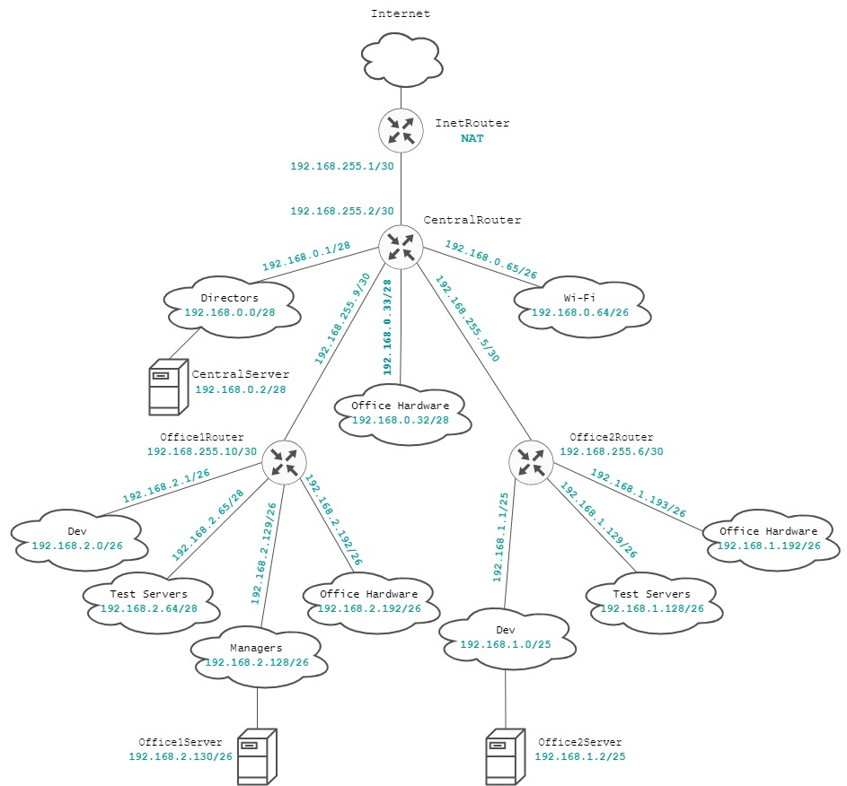

# Otus Homework 18. Архитектура сетей.
### Цель домашнего задания
Научится менять базовые сетевые настройки в Linux-based системах.
### Описание домашнего задания
1. Скачать и развернуть [Vagrant-стенд](https://github.com/erlong15/otus-linux/tree/network)
2. Построить следующую сетевую архитектуру:
  
Сеть **office1**:  
- 192.168.2.0/26 - dev
- 192.168.2.64/26 - test servers
- 192.168.2.128/26 - managers
- 192.168.2.192/26 - office hardware

Сеть **office2**:  
- 192.168.1.0/25 - dev
- 192.168.1.128/26 - test servers
- 192.168.1.192/26 - office hardware

Сеть **central**:  
- 192.168.0.0/28 - directors
- 192.168.0.32/28 - office hardware
- 192.168.0.64/26 - wifi

  
Итого должны получиться следующие сервера:
- inetRouter
- centralRouter
- office1Router
- office2Router
- centralServer
- office1Server
- office2Server
  
Задание состоит из 2-х частей: теоретической и практической.  
  
**Теоретическая часть:**
- Найти свободные подсети
- Посчитать количество узлов в каждой подсети, включая свободные
- Указать Broadcast-адрес для каждой подсети
- Проверить, нет ли ошибок при разбиении
  
**Практическая часть:**
- Соединить офисы в сеть согласно логической схеме и настроить роутинг
- Интернет-трафик со всех серверов должен ходить через inetRouter
- Все сервера должны видеть друг друга (должен проходить ping)
- У всех новых серверов отключить дефолт на NAT (eth0), который vagrant поднимает для связи
- Добавить дополнительные сетевые интерфейсы, если потребуется

## Выполнение
### Теоритическая часть
Исходя из заданой сетевой адресации, построим таблицу:
  
<table>
  <tr>
    <th>Название</th>
    <th>Подсеть</th>
    <th>Маска</th>
    <th>Количество хостов</th>
    <th>Начальный адрес</th>
    <th>Последний адрес</th>
    <th>Broadcast</th>
  </tr>
  <tr>
    <th colspan="7">Сеть Central</th>
  </tr>
  <tr>
    <th>Directors</th>
    <td>192.168.0.0/28</td>
    <td>255.255.255.240</td>
    <td>14</td>
    <td>192.168.0.1</td>
    <td>192.168.0.14</td>
    <td>192.168.0.15</td>
  </tr>
  <tr>
    <th>Office Hardware</th>
    <td>192.168.0.32/28</td>
    <td>255.255.255.240</td>
    <td>14</td>
    <td>192.168.0.33</td>
    <td>192.168.0.46</td>
    <td>192.168.0.47</td>
  </tr>
  <tr>
    <th>Wi-Fi</th>
    <td>192.168.0.64/26</td>
    <td>255.255.255.192</td>
    <td>62</td>
    <td>192.168.0.65</td>
    <td>192.168.0.126</td>
    <td>192.168.0.127</td>
  </tr>
  <tr>
    <th colspan="7">Сеть Office1</th>
  </tr>
  <tr>
    <th>Dev</th>
    <td>192.168.2.0/26</td>
    <td>255.255.255.192</td>
    <td>62</td>
    <td>192.168.0.1</td>
    <td>192.168.0.62</td>
    <td>192.168.0.63</td>
  </tr>
  <tr>
    <th>Test Servers</th>
    <td>192.168.2.64/26</td>
    <td>255.255.255.192</td>
    <td>62</td>
    <td>192.168.0.65</td>
    <td>192.168.0.126</td>
    <td>192.168.0.127</td>
  </tr>
  <tr>
    <th>Managers</th>
    <td>192.168.2.128/26</td>
    <td>255.255.255.192</td>
    <td>62</td>
    <td>192.168.0.129</td>
    <td>192.168.0.190</td>
    <td>192.168.0.191</td>
  </tr>
   <tr>
    <th>Office Hardware</th>
    <td>192.168.2.192/26</td>
    <td>255.255.255.192</td>
    <td>62</td>
    <td>192.168.0.193</td>
    <td>192.168.0.254</td>
    <td>192.168.0.255</td>
  </tr> 
  <tr>
    <th colspan="7">Сеть Office2</th>
  </tr>
  <tr>
    <th>Dev</th>
    <td>192.168.1.0/25</td>
    <td>255.255.255.128</td>
    <td>126</td>
    <td>192.168.1.1</td>
    <td>192.168.1.126</td>
    <td>192.168.1.127</td>
  </tr>
  <tr>
    <th>Test Servers</th>
    <td>192.168.1.128/26</td>
    <td>255.255.255.192</td>
    <td>62</td>
    <td>192.168.1.129</td>
    <td>192.168.1.190</td>
    <td>192.168.1.191</td>
  </tr>
   <tr>
    <th>Office Hardware</th>
    <td>192.168.1.192/26</td>
    <td>255.255.255.192</td>
    <td>62</td>
    <td>192.168.1.193</td>
    <td>192.168.1.254</td>
    <td>192.168.1.255</td>
  </tr> 
  <tr>
    <th colspan="7">Сеть CentralRouter-InetRouter</th>
  </tr>
  <tr>
    <th>Central-Inet</th>
    <td>192.168.255.0/30</td>
    <td>255.255.255.252</td>
    <td>2</td>
    <td>192.168.255.1</td>
    <td>192.168.255.2</td>
    <td>192.168.1.3</td>
  </tr>
</table>

Мы можем определить свободные подсети в используемых диапазонах:
  
<table>
<th colspan="7">Свободные подсети</th>
  <tr>
    <th>Подсеть</th>
    <th>Маска</th>
    <th>Количество хостов</th>
    <th>Начальный адрес</th>
    <th>Последний адрес</th>
    <th>Broadcast</th>
  </tr>
  <tr>
    <td>192.168.0.16/28</td>
    <td>255.255.255.240</td>
    <td>14</td>
    <td>192.168.0.17</td>
    <td>192.168.0.30</td>
    <td>192.168.0.31</td>
  </tr>
  <tr>
    <td>192.168.0.48/28</td>
    <td>255.255.255.240</td>
    <td>14</td>
    <td>192.168.0.17</td>
    <td>192.168.0.62</td>
    <td>192.168.0.63</td>
  </tr>  
    <tr>
    <td>192.168.0.128/25</td>
    <td>255.255.255.128</td>
    <td>126</td>
    <td>192.168.0.129</td>
    <td>192.168.0.254</td>
    <td>192.168.0.255</td>
  </tr>
  <tr>
    <td>192.168.255.4/30</td>
    <td>255.255.255.252</td>
    <td>2</td>
    <td>192.168.255.5</td>
    <td>192.168.255.6</td>
    <td>192.168.255.7</td>
  </tr>  
  <tr>
    <td>192.168.255.8/29</td>
    <td>255.255.255.248</td>
    <td>6</td>
    <td>192.168.255.9</td>
    <td>192.168.255.14</td>
    <td>192.168.255.15</td>
  </tr>  
  <tr>
    <td>192.168.255.16/28</td>
    <td>255.255.255.240</td>
    <td>14</td>
    <td>192.168.255.17</td>
    <td>192.168.255.30</td>
    <td>192.168.255.31</td>
  </tr>  
  <tr>
    <td>192.168.255.32/27</td>
    <td>255.255.255.224</td>
    <td>30</td>
    <td>192.168.255.33</td>
    <td>192.168.255.62</td>
    <td>192.168.255.63</td>
  </tr>  
  <tr>
    <td>192.168.255.64/26</td>
    <td>255.255.255.192</td>
    <td>62</td>
    <td>192.168.255.65</td>
    <td>192.168.255.126</td>
    <td>192.168.255.127</td>
  </tr>  
  <tr>
    <td>192.168.255.128/25</td>
    <td>255.255.255.128</td>
    <td>126</td>
    <td>192.168.255.129</td>
    <td>192.168.255.254</td>
    <td>192.168.255.255</td>
  </tr>  
</table>

### Практическая часть
Построим карту сети, выделив из свободного диапозона 2 подсети по 30 маске для соединения CentralRouter и Office1Router, а также CentralRouter и Office2Router:  
  


  
На основании схемы построим таблицу адресации серверов:
<table>
  <tr>
    <th>Название</th>
    <th>IP-адрес</th>
    <th>С чем соединен интерфейс</th>
  </tr>
  <tr>
    <th rowspan="2">InetRouter</th>
    <td>VirtualBox NAT Network</td>
    <td>VirtualBox Host</td>
  </tr>
  <tr>
    <td>192.168.255.1/30</td>
    <td>CentralRouter</td>
  </tr>  
    <tr>
    <th rowspan="6">CentralRouter</th>
    <td>192.168.255.2/30</td>
    <td>InetRouter</td>
  </tr>
  <tr>
    <td>192.168.0.1/28</td>
    <td>CentralServer</td>
  </tr>  
  <tr>
    <td>192.168.0.33/28</td>
    <td>Подсеть Office Hardware</td>
  </tr>  
   <tr>
    <td>192.168.0.65/26</td>
     <td>Подсеть Wi-Fi</td>
  </tr>
  <tr>
    <td>192.168.255.5/30</td>
     <td>Office2Router</td>
  </tr>
  <tr>
    <td>192.168.255.9/30</td>
     <td>Office1Router</td>
  </tr>
  <tr>
    <th rowspan="5">Office1Router</th>
    <td>192.168.2.1/26</td>
    <td>Подсеть Dev</td>
  </tr>
  <tr>
    <td>192.168.2.65/28</td>
    <td>Подсеть Test Servers</td>
  </tr>
  <tr>
    <td>192.168.2.129/26</td>
    <td>Office1Server</td>
  </tr>
  <tr>
    <td>192.168.2.192/26</td>
    <td>Подсеть Office Hardware</td>
  </tr>
  <tr>
    <td>192.168.255.10/30</td>
     <td>CentralRouter</td>
  </tr>
  <tr>
    <th rowspan="4">Office2Router</th>
    <td>192.168.1.1/25</td>
    <td>Office2Server</td>
  </tr>
  <tr>
    <td>192.168.1.129/26</td>
    <td>Подсеть Test Servers</td>
  </tr>
  <tr>
    <td>192.168.1.192/26</td>
    <td>Подсеть Office Hardware</td>
  </tr>
  <tr>
    <td>192.168.255.6/30</td>
     <td>CentralRouter</td>
  </tr>
  <tr>
    <th>CentralServer</th>
    <td>192.168.0.2/28</td>
    <td>CentralRouter</td>
  </tr>
  <tr>
    <th>Office1Server</th>
    <td>192.168.2.130/26</td>
    <td>Office1Router</td>
  </tr>
  <tr>
    <th>Office2Server</th>
    <td>192.168.1.2/25</td>
    <td>Office2Router</td>
  </tr>
</table>  
  
Реализуем эту схему с помощью **Vagrant**.  Управлять серверами будем с помощью **Ansible**. Для этого каждому серверу добавим еще один сетевой интерфейс в подсети 192.168.56.0/24.

Для начала настроим сервера вручную. На всех серверах, кроме **inetRouter** удалим, созданный Vagrant'ом, маршрут по умолчанию. Для этого изменим файл /etc/netplan/00-installer-config.yaml
```bash
network:
  ethernets:
    eth0:
      dhcp4: true
      dhcp4-overrides:
        use-routes: false
      dhcp6: false
  version: 2
```
Добавим недостающие маршруты. На серверах **centralServer**, **office1Server**, **office2Server**, **office1Router** и **office2Router** достаточно добавить маршрут по умолчанию:
#### centralServer
```bash
ip route add default via 192.168.0.1
```
#### office1Server
```bash
ip route add default via 192.168.2.129
```
#### office2Server
```bash
ip route add default via 192.168.1.1
```
#### office1Router
```bash
ip route add default via 192.168.255.9
```
#### office2Router
```bash
ip route add default via 192.168.255.5
```
На сервере **centralRouter** добавим два маршрута в подсети 192.168.1.0/24 и 192.168.2.0/24, а также марщрут по умолчанию:
#### centralRouter
```bash
ip route add 192.168.1.0/24 via 192.168.255.6
ip route add 192.168.2.0/24 via 192.168.255.10
ip route add default via 192.168.255.1
```
На сервере **inetRouter** необходимо указать маршруты в каждую подсеть:
#### inetRouter
```bash
ip route add 192.168.1.0/24 via 192.168.255.2
ip route add 192.168.2.0/24 via 192.168.255.2
ip route add 192.168.0.0/24 via 192.168.255.2
ip route add 192.168.255.4/30 via 192.168.255.2
ip route add 192.168.255.8/30 via 192.168.255.2
```
